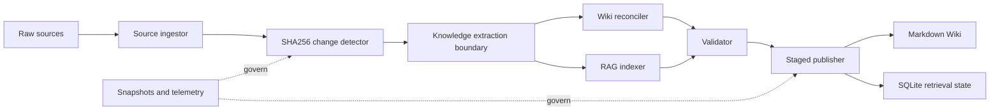

# LLM-WIKI-RAG

**A governed hybrid knowledge base: readable Wiki for people, retrieval index for AI, deterministic control plane for both.**

[Русская версия](README.ru.md) · [Architecture](docs/ARCHITECTURE.md) · [Security](SECURITY.md) · [Contributing](CONTRIBUTING.md)

[](https://github.com/sergekostenchuk/LLM-WIKI-RAG/actions/workflows/ci.yml)
[](https://www.npmjs.com/package/llm-wiki-rag)
[](LICENSE)
[](https://www.python.org/)


## What it is

LLM-WIKI-RAG keeps two complementary representations of the same source collection in sync:

- a Markdown Wiki that people and LLM agents can inspect, link, review, and version;
- a chunked retrieval index that can find relevant source passages at query time;
- a deterministic control plane that owns hashes, provenance, transactions, deletion boundaries, snapshots, and rollback.

The local production profile uses Python and SQLite and does not require a hosted vector database. It is useful on its own and can also serve as the governed ingestion layer for a larger agent platform.

## What it does

- Detects added, modified, renamed, unchanged, and removed sources with SHA256.
- Preserves source identity across exact-content renames.
- Builds source-backed Wiki pages and retrieval chunks in a staged transaction.
- Skips unchanged files to reduce compute and token usage.
- Blocks destructive cleanup until the source is absent and the operator confirms it.
- Creates snapshots before mutations and verifies raw-source hashes before rollback.
- Supports dry-run, audit, rebuild, query, conflicts, migrations, health checks, watcher mode, and cron planning.
- Applies locks, source/chunk budgets, secret scanning, redacted approval packets, telemetry, and independent validation.

## Why not just a Wiki or just RAG?

| Capability | LLM Wiki only | RAG only | LLM-WIKI-RAG |
|---|---:|---:|---:|
| Human-readable structure | Strong | Weak | Strong |
| Passage-level retrieval | Limited | Strong | Strong |
| Fresh incremental updates | Often expensive | Fast | Fast and governed |
| Provenance and auditability | Varies | Often opaque | Source IDs, hashes, reports |
| Safe deletion and rollback | Usually manual | Provider-specific | Confirmed cleanup + snapshots |
| Cross-system consistency | Not applicable | Not applicable | One change set controls both |
| Local/offline baseline | Possible | Varies | Included |

A Wiki alone is excellent for stable concepts but expensive to regenerate continuously and easy to leave with stale links. RAG alone is fast and flexible but usually gives operators little visibility into what was indexed and why. Running both as unrelated pipelines creates a third problem: drift.

LLM-WIKI-RAG uses one source manifest and one transaction boundary for Wiki and retrieval state. The result is not merely “Wiki plus vectors”; it is a coordinated lifecycle with evidence and recovery.

## How the modules work

| Module | Responsibility |
|---|---|
| Source ingestor | Reads supported files and records parser provenance. |
| Change detector | Computes SHA256 changes and exact-content renames. |
| Knowledge extractor | Defines the semantic extraction boundary for optional LLM enrichment. |
| Wiki reconciler | Produces source-backed Markdown and maintains navigation. |
| RAG indexer | Chunks content and writes versioned embeddings. |
| Validator | Checks hashes, links, source/chunk consistency, and conflicts. |
| Publisher | Publishes staged Wiki and SQLite state atomically. |
| Operations runtime | Locks, budgets, security findings, telemetry, migrations, health, snapshots, and rollback. |

The shipped `local-python-sqlite` profile is deterministic: it creates provenance-rich source pages and uses `hashing-v1` vectors. Optional LLM entity extraction and the `http-json-v1` embedding adapter are extension points; they are not silently called by the default profile.



## Update lifecycle


Every mutation follows the same contract:

1. Scan sources and calculate a change set.
2. Preview the plan without writes.
3. Acquire an exclusive mutation lock.
4. Enforce budgets and security gates.
5. Create a pre-change snapshot.
6. Build Wiki pages and chunks in staging.
7. Validate the staged state.
8. Publish atomically and emit reports/telemetry.

Deletion is intentionally stricter: moving or removing the raw source is not enough. Derived cleanup also requires explicit confirmation.

## Who it is for

- Engineering teams maintaining architecture, runbooks, ADRs, and onboarding knowledge.
- AI product teams that need explainable retrieval rather than a black-box vector upload.
- Agencies and consultants operating separate client knowledge bases.
- Research teams combining stable concepts with frequently updated evidence.
- Local-first and privacy-sensitive users who want an offline baseline.
- Agent builders who need a reusable knowledge-maintenance skill with worker contracts.

## What the user gets

- A navigable Markdown knowledge base.
- A queryable local retrieval index.
- Incremental updates instead of full rebuilds.
- Evidence for every run under `agent-workspace/runs/`.
- Provenance from chunks and Wiki pages back to raw sources.
- Snapshots, guarded rollback, health checks, and operational runbooks.
- A portable Codex skill package and an npm CLI distribution.

## Requirements

- Node.js 18+ and npm 9+ for the npm launcher.
- Python 3.11+ for the knowledge runtime.
- `pdftotext` only when ingesting PDF documents.
- No external service for the default `local-python-sqlite` profile.

## Install

The package name is prepared as `llm-wiki-rag` but is not considered reserved until the first npm publication.

```bash
npm install --global llm-wiki-rag
llm-wiki-rag --version
```

Or run without a global install:

```bash
npx llm-wiki-rag --help
```

If Python is not on the default path:

```bash
export LLM_WIKI_RAG_PYTHON=/absolute/path/to/python3
```

## Quick start

```bash
# 1. Initialize a knowledge project
llm-wiki-rag init --project ./knowledge-base

# 2. Add .md, .markdown, .txt, or .pdf files
cp handbook.md ./knowledge-base/raw/sources/

# 3. Preview the update
llm-wiki-rag update --project ./knowledge-base

# 4. Apply it
llm-wiki-rag update --project ./knowledge-base --apply

# 5. Inspect and query
llm-wiki-rag status --project ./knowledge-base
llm-wiki-rag audit --project ./knowledge-base
llm-wiki-rag query --project ./knowledge-base --text "How do we recover from an incident?"
```

### Safe deletion

The tool never deletes raw sources. Move or remove the source yourself, preview the cleanup, then confirm the derived-state deletion:

```bash
llm-wiki-rag delete \
  --project ./knowledge-base \
  --source raw/sources/obsolete.md

llm-wiki-rag delete \
  --project ./knowledge-base \
  --source raw/sources/obsolete.md \
  --apply --confirm
```

### Rollback

```bash
llm-wiki-rag snapshots --project ./knowledge-base
llm-wiki-rag rollback \
  --project ./knowledge-base \
  --snapshot <snapshot-id> \
  --confirm
```

Rollback refuses to proceed when current raw-source hashes do not match the target snapshot.

### Use as a Codex skill

The npm package contains the complete skill source. Find it with:

```bash
llm-wiki-rag --print-skill-path
```

Copy that directory to your Codex skills directory as `llm-wiki-rag-orchestrator`, or install the `.skill` artifact from a GitHub release. Runtime installation is intentionally separate from npm installation so users control when their agent environment changes.

## Project layout

```text
knowledge-base/
├── raw/sources/              # Authoritative source documents
├── wiki/sources/             # Generated source-backed pages
├── vector_db/state.sqlite3   # Source, chunk, vector, run, and approval state
├── agent-workspace/runs/     # Machine-readable run evidence
├── .llm-wiki-rag/
│   ├── config.json
│   ├── snapshots/
│   └── staging/
├── index.md
└── overview.md
```

## Risks and operating boundaries

- **Back up raw sources.** Snapshots protect managed Wiki and database state, not your authoritative source folder.
- **Review generated knowledge.** Optional LLM enrichment can omit context or introduce incorrect relationships; deterministic provenance does not make model output true.
- **Treat deletion confirmation seriously.** Cleanup removes derived pages and chunks. A snapshot is created, but operators must still verify scope.
- **Protect secrets and personal data.** The scanner blocks common secret patterns and creates redacted review packets, but no scanner guarantees complete detection.
- **Understand local vectors.** `hashing-v1` is deterministic and offline, but it is not equivalent to a high-quality semantic embedding model.
- **Verify external adapters.** `http-json-v1` is conditional until a concrete endpoint, model, dimensions, credentials, rate limits, and retrieval quality are tested.
- **Do not expose the SQLite file to concurrent writers.** Use the provided commands and lock instead of editing state directly.
- **Test upgrades and rollback.** Migration backups and snapshots reduce risk but do not replace environment-specific recovery drills.

See [SECURITY.md](SECURITY.md) and the [operations architecture](docs/ARCHITECTURE.md) for details.

## Development

```bash
npm install
npm test
npm run pack:dry-run
```

The repository has no runtime npm dependencies. The npm layer is a portable launcher; the production knowledge runtime remains Python standard-library-first.

## Publication

Repository creation and npm publishing are intentionally not automatic. Follow [docs/PUBLISHING.md](docs/PUBLISHING.md) after reviewing package ownership, npm trusted publishing, release notes, and the dry-run tarball.

## License

Licensed under the [Apache License 2.0](LICENSE). You may use, modify, and distribute the project under its terms. Preserve the license and NOTICE information, state significant changes, and review patent/trademark obligations. This is a project license choice, not legal advice.

Copyright 2026 Sergey Kostenchuk.
