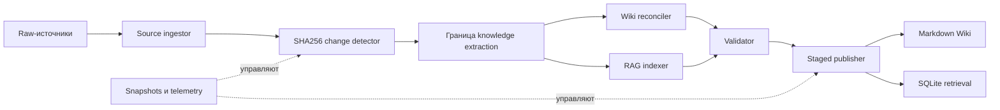
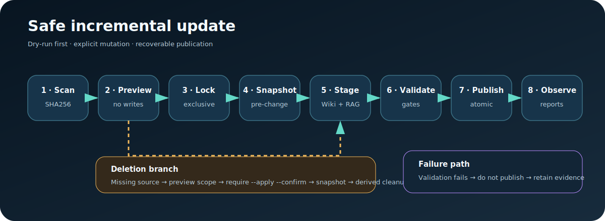

# LLM-WIKI-RAG

**Управляемая гибридная база знаний: понятная Wiki для людей, retrieval-индекс для ИИ и единый детерминированный контур управления.**

[English](README.md) · [Архитектура](docs/ARCHITECTURE.ru.md) · [Безопасность](SECURITY.md) · [Участие в разработке](CONTRIBUTING.md)

[](https://github.com/sergekostenchuk/LLM-WIKI-RAG/actions/workflows/ci.yml)
[](https://www.npmjs.com/package/llm-wiki-rag)
[](LICENSE)
[](https://www.python.org/)


## Что это

LLM-WIKI-RAG синхронно поддерживает два представления одного набора источников:

- Markdown Wiki, которую могут читать, связывать, проверять и версионировать люди и ИИ-агенты;
- индекс из чанков, позволяющий находить релевантные фрагменты в момент запроса;
- детерминированный управляющий слой, отвечающий за хэши, provenance, транзакции, границы удаления, snapshots и rollback.

Локальный production-профиль работает на Python и SQLite и не требует облачной векторной базы. Его можно использовать самостоятельно или как контролируемый ingestion-слой более крупной агентной системы.

## Что делает система

- Обнаруживает новые, изменённые, переименованные, неизменные и удалённые источники через SHA256.
- Сохраняет идентичность источника при переименовании без изменения содержимого.
- Собирает Wiki-страницы и retrieval-чанки в staging и публикует их одной транзакцией.
- Пропускает неизменённые файлы, сокращая вычисления и расходы на токены.
- Блокирует очистку, пока источник не удалён оператором и действие явно не подтверждено.
- Создаёт snapshot перед изменением и проверяет хэши raw-источников перед rollback.
- Поддерживает dry-run, audit, rebuild, query, conflicts, migrations, healthcheck, watcher и планирование cron.
- Применяет эксклюзивные блокировки, бюджеты, поиск секретов, редактированные approval-пакеты, telemetry и независимую валидацию.

## Почему не только LLM Wiki или только RAG

| Возможность | Только LLM Wiki | Только RAG | LLM-WIKI-RAG |
|---|---:|---:|---:|
| Понятная человеку структура | Сильная | Слабая | Сильная |
| Поиск конкретных фрагментов | Ограниченный | Сильный | Сильный |
| Быстрые инкрементальные обновления | Часто дорогие | Быстрые | Быстрые и контролируемые |
| Provenance и аудит | Зависит от реализации | Часто непрозрачно | IDs, хэши и отчёты |
| Безопасное удаление и откат | Обычно вручную | Зависит от провайдера | Подтверждение + snapshots |
| Согласованность Wiki и индекса | Не применимо | Не применимо | Одна changeset для обоих слоёв |
| Локальная работа | Возможна | Зависит от стека | Входит в поставку |

Wiki хорошо подходит для стабильных концептов, но её дорого постоянно переписывать и легко оставить со старыми ссылками. RAG быстро обновляется, однако часто остаётся «чёрным ящиком»: оператору трудно понять, что именно было проиндексировано. Если поддерживать Wiki и RAG двумя независимыми пайплайнами, возникает третья проблема — рассинхронизация.

LLM-WIKI-RAG использует общий manifest источников и одну транзакционную границу для Wiki и retrieval. Это не просто «Wiki плюс векторы», а полный жизненный цикл с доказательствами и восстановлением.

## Как работают модули

| Модуль | Зона ответственности |
|---|---|
| Source ingestor | Читает поддерживаемые файлы и фиксирует provenance парсера. |
| Change detector | Вычисляет SHA256-изменения и точные переименования. |
| Knowledge extractor | Задаёт границу семантического извлечения для опционального LLM-обогащения. |
| Wiki reconciler | Создаёт Markdown со ссылками на источники и обновляет навигацию. |
| RAG indexer | Нарезает контент и записывает версионированные embeddings. |
| Validator | Проверяет хэши, ссылки, согласованность источников и чанков, конфликты. |
| Publisher | Атомарно публикует staging Wiki и SQLite-состояние. |
| Operations runtime | Блокировки, бюджеты, security, telemetry, migrations, health, snapshots и rollback. |

Поставляемый профиль `local-python-sqlite` детерминирован: он создаёт source-backed страницы с provenance и использует векторы `hashing-v1`. LLM-извлечение сущностей и адаптер `http-json-v1` являются точками расширения и не вызываются скрыто в стандартном профиле.



## Цикл обновления



Каждое изменение проходит единый контракт:

1. Сканирование источников и построение changeset.
2. Предпросмотр плана без записи.
3. Получение эксклюзивной блокировки.
4. Проверка бюджетов и security-gates.
5. Создание snapshot до изменения.
6. Сборка Wiki и чанков в staging.
7. Валидация staging-состояния.
8. Атомарная публикация, отчёт и telemetry.

Удаление намеренно строже: недостаточно удалить или переместить raw-файл — очистку производных данных нужно подтвердить отдельно.

## Кому это полезно

- Инженерным командам с архитектурой, runbooks, ADR и онбордингом.
- Разработчикам ИИ-продуктов, которым нужен объяснимый retrieval вместо непрозрачной загрузки в vector DB.
- Агентствам и консультантам, поддерживающим отдельные клиентские базы знаний.
- Исследовательским группам, объединяющим стабильные понятия и быстро меняющиеся материалы.
- Пользователям с требованиями локальности и приватности.
- Создателям агентов, которым нужен переиспользуемый maintenance-skill с worker-контрактами.

## Что получает пользователь

- Навигационную Markdown-базу знаний.
- Локальный retrieval-индекс с запросами.
- Инкрементальные обновления вместо полных пересборок.
- Отчёт для каждого запуска в `agent-workspace/runs/`.
- Provenance от Wiki и чанков к исходным документам.
- Snapshots, защищённый rollback, healthcheck и operational runbooks.
- Переносимый Codex skill и npm CLI.

## Требования

- Node.js 18+ и npm 9+ для npm launcher.
- Python 3.11+ для knowledge runtime.
- `pdftotext` только для PDF.
- Для профиля `local-python-sqlite` внешние сервисы не нужны.

## Установка

Пакет подготовлен под имя `llm-wiki-rag`, но имя окончательно резервируется только первой публикацией в npm.

```bash
npm install --global llm-wiki-rag
llm-wiki-rag --version
```

Запуск без глобальной установки:

```bash
npx llm-wiki-rag --help
```

Если Python находится в нестандартном месте:

```bash
export LLM_WIKI_RAG_PYTHON=/absolute/path/to/python3
```

## Быстрый старт

```bash
# 1. Инициализация
llm-wiki-rag init --project ./knowledge-base

# 2. Добавление .md, .markdown, .txt или .pdf
cp handbook.md ./knowledge-base/raw/sources/

# 3. Dry-run
llm-wiki-rag update --project ./knowledge-base

# 4. Применение
llm-wiki-rag update --project ./knowledge-base --apply

# 5. Проверка и поиск
llm-wiki-rag status --project ./knowledge-base
llm-wiki-rag audit --project ./knowledge-base
llm-wiki-rag query --project ./knowledge-base --text "Как восстановиться после инцидента?"
```

### Безопасное удаление

Инструмент не удаляет raw-источники. Сначала переместите или удалите файл самостоятельно, проверьте план и только затем подтвердите очистку производных данных:

```bash
llm-wiki-rag delete \
  --project ./knowledge-base \
  --source raw/sources/obsolete.md

llm-wiki-rag delete \
  --project ./knowledge-base \
  --source raw/sources/obsolete.md \
  --apply --confirm
```

### Rollback

```bash
llm-wiki-rag snapshots --project ./knowledge-base
llm-wiki-rag rollback \
  --project ./knowledge-base \
  --snapshot <snapshot-id> \
  --confirm
```

Rollback блокируется, если текущие хэши raw-источников не соответствуют целевому snapshot.

### Использование как Codex skill

npm-пакет содержит полный исходник скилла. Его путь можно получить командой:

```bash
llm-wiki-rag --print-skill-path
```

Скопируйте этот каталог в директорию Codex skills под именем `llm-wiki-rag-orchestrator` или установите `.skill` из GitHub Release. Установка в runtime отделена от npm, чтобы пользователь сам контролировал изменения агентной среды.

## Структура проекта знаний

```text
knowledge-base/
├── raw/sources/              # Авторитетные исходные документы
├── wiki/sources/             # Производные source-backed страницы
├── vector_db/state.sqlite3   # Источники, чанки, векторы, runs и approvals
├── agent-workspace/runs/     # Машиночитаемые доказательства запусков
├── .llm-wiki-rag/
│   ├── config.json
│   ├── snapshots/
│   └── staging/
├── index.md
└── overview.md
```

## Риски и границы эксплуатации

- **Создавайте резервные копии raw-источников.** Snapshots защищают управляемую Wiki и БД, но не авторитетную папку источников.
- **Проверяйте сгенерированные знания.** Опциональный LLM может пропустить контекст или создать неверную связь; наличие provenance не делает вывод модели истинным.
- **Осознанно подтверждайте удаление.** Cleanup удаляет производные страницы и чанки. Snapshot снижает риск, но оператор обязан проверить scope.
- **Защищайте секреты и персональные данные.** Сканер блокирует распространённые шаблоны и редактирует approval-пакеты, но не гарантирует обнаружение всего.
- **Понимайте ограничения локальных векторов.** `hashing-v1` детерминирован и работает offline, но не равен качественной семантической embedding-модели.
- **Проверяйте внешние адаптеры.** `http-json-v1` остаётся условным до проверки endpoint, модели, dimensions, credentials, rate limits и retrieval-качества.
- **Не редактируйте SQLite параллельно.** Используйте команды и встроенную блокировку.
- **Тестируйте обновления и откат.** Migration backups и snapshots снижают риск, но не заменяют recovery drills в вашей среде.

Подробнее: [SECURITY.md](SECURITY.md) и [архитектура эксплуатации](docs/ARCHITECTURE.ru.md).

## Разработка

```bash
npm install
npm test
npm run pack:dry-run
```

У проекта нет runtime-зависимостей npm. npm-слой — переносимый launcher, а production-runtime остаётся Python standard-library-first.

## Публикация

Создание GitHub-репозитория и npm publish намеренно не автоматизированы без явной команды владельца. Checklist находится в [docs/PUBLISHING.ru.md](docs/PUBLISHING.ru.md).

## Лицензия

Проект распространяется по [Apache License 2.0](LICENSE). Разрешены использование, изменение и распространение при соблюдении её условий. Необходимо сохранять лицензию и NOTICE, отмечать существенные изменения и учитывать патентные и trademark-условия. Это выбранная лицензия проекта, а не юридическая консультация.

Copyright 2026 Sergey Kostenchuk.
