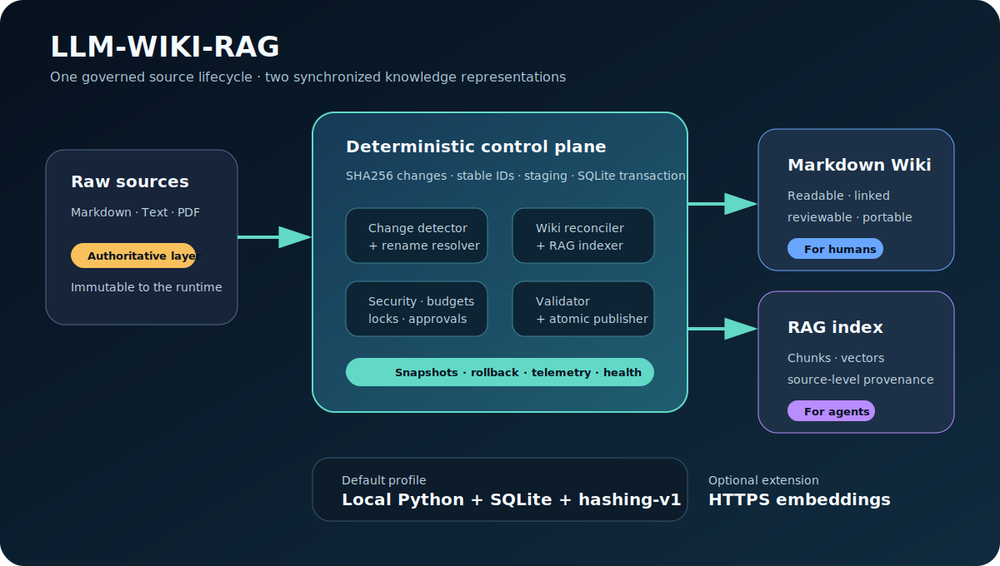

# Architecture

LLM-WIKI-RAG separates authoritative input, deterministic state management, optional semantic reasoning, and published knowledge.

## Layers

1. **Source layer** — user-owned `.md`, `.markdown`, `.txt`, and optional PDF files.
2. **Control plane** — scanning, SHA256 changes, source identity, locks, budgets, security gates, snapshots, staging, validation, and transactions.
3. **Wiki layer** — inspectable Markdown pages, index, overview, and provenance.
4. **Retrieval layer** — chunks, vectors, source IDs, vector versions, and queries in SQLite.
5. **Operations layer** — reports, metrics, health checks, migrations, watcher/cron adapters, incidents, and rollback.

## Trust model

Raw sources are authoritative. Deterministic code owns all durable state transitions. Optional LLM workers may propose semantic structures, but their output must remain attributable to sources and pass validation before publication.

The default `hashing-v1` adapter offers deterministic offline retrieval. The `http-json-v1` adapter is not production-ready until its endpoint, credentials, model, dimensions, response schema, reliability, and retrieval quality have been validated for the deployment.

## Consistency model

Wiki pages and retrieval chunks are derived from one change set. Mutations run under an exclusive lock, create a snapshot, build into staging, validate, and publish together. SQLite is the durable state registry; raw files remain outside runtime mutation scope.

## Failure behavior

- Parser or validation failure prevents publication.
- Budget or security violations block before durable mutation.
- Unconfirmed deletion remains planned and does not remove derived state.
- Rollback requires an existing snapshot and matching raw-source hashes.
- Reports preserve the reason and failure mode for operator review.

See the skill's `references/` directory for worker contracts, runbooks, SLOs, migrations, security boundaries, and failure-mode details.
